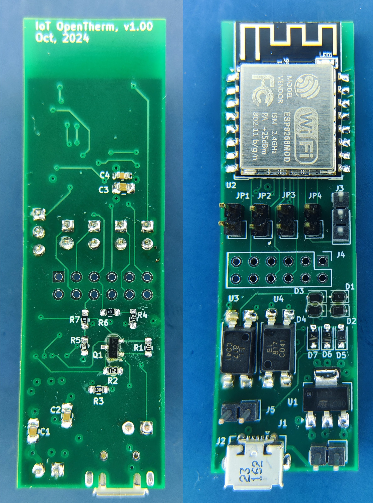

# IoT OpenTherm Project

<p align="left">
  
  
</p>

Project here called **IoT OpenTherm** is IoT device project to control the furnace using OpenTherm protocol/interface. This device allows to integrate OpenTherm compatible endpoint/slave with IoT infrastructure. Project is inspired with following projects:
* https://ihormelnyk.com/opentherm_thermostat
* https://olegtarasov.me/opentherm-thermostat-esphome
* https://github.com/arthurrump/esphome-opentherm

Repository here contains multiple components like HW, FW, SW, docs.

To clone the repository:
```
git clone --recurse-submodules https://github.com/elezbyl/iot-opentherm.git
```

## HW
IoT OpenTherm HW Project is based on ESP-12S WiFi module and Ihor's Melnyk adapter design. More details can be found [here](hw/README.md)

## FW
There are various different IoT FW stack which could be used for IoT OpenTherm project. More details can be found [here](fw/README.md)
