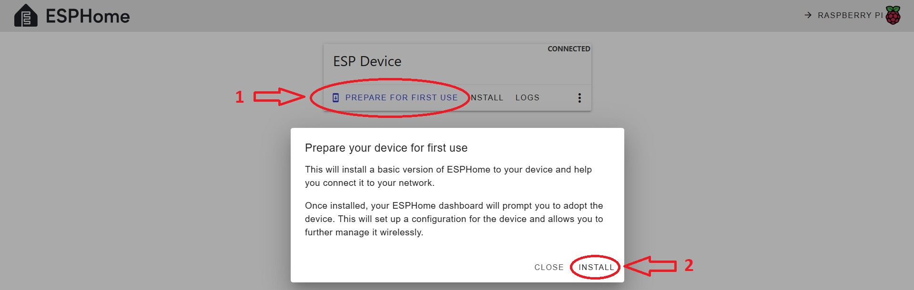

# IoT OpenTherm Project Firmware
Multiple different IoT FW stacks can be used to run IoT OpenTherm device. Two most popular stacks are described here:
* ESP Home - based on https://github.com/arthurrump/esphome-opentherm
* Tasmota

Each of most common IoT FW stacks can be integrated with IoT SW infrastructure like Home Assistant.

## IoT FW: ESP Home
ESP Home image can be built using instructions provided below. More details can be found [here](https://esphome.io/guides/getting_started_command_line.html).

Firstly, ESP Home environment shall be setup either with docker (mentioned under link above) or [manually](https://esphome.io/guides/installing_esphome).

For building the ESP Home image, .yaml configuration file is required. This file describes ESP Home FW configuration. It can be prepared from scratch using [wizard](https://esphome.io/guides/cli.html#wizard-command) option from *esphome* tool. Alternatively, example [opentherm.yaml](opentherm.yaml) (based on basic [thermostat-number-minimal.yaml](https://github.com/arthurrump/esphome-opentherm/blob/main/examples/thermostat-number-minimal.yaml)) can be used (some items may require update, e.g. ESP device host name, wifi credential, AP details, etc.). In case more advanced use case following example could be used [thermostat-pid-complete.yaml](https://github.com/arthurrump/esphome-opentherm/blob/main/examples/thermostat-pid-complete.yaml), especially part under `opentherm` tag.

Description for *esphome* cli can be found [here](https://esphome.io/guides/cli.html).

Below there is example steps for building EPS Home image under Windows using [opentherm.yaml](opentherm.yaml) configuration file and Python 3.13.0:

```
# Prepare ESP Home environment
pip3 install wheel typing_extensions esphome

# Prepare configuration file
copy opentherm.yaml <work directory>
cd <work directory>

# Validate the configuration
esphome config opentherm.yaml

# Build ESP Home image
esphome compile opentherm.yaml
```

Building result - the image, can be found under:
```
<work dir>\.esphome\build\my-esp-device-host-name\.pioenvs\my-esp-device-host-name\firmware.bin"
```

ESP Home FW image can be loaded into the ESP module using either OTA (Over-The-Air) or download mode FW update method.

OTA method does not require any extra devices/tools - just wifi network to be available. But it requires ESP module to run basic/initial ESP Home image at least. This method is recommended in case ESP module was loaded with ESP Home FW before.

Download mode method requires USB<->UART converter. Converted shall be connected to the **J3** header (UART side), just like on the picture below, and to the host (USB side). Example converted can be found [here](https://www.mouser.pl/ProductDetail/FTDI/TTL-232R-RPI?qs=3tuk1l7PSbNqj0mOeA5IPw%3D%3D). This method is required for brand new ESP module which is equipped with AiThinker's FW by default. Download mode shall be activated in the ESP module before starting the ESP Home image load. To put ESP module into download mode, **GPIO0** shall be driven LOW and the module shall be reset. **GPIO0** is available on **JP3** jumper and reset is available on **JP1** jumper. Thus, both **JP3** and then **JP1** shall be populated and then **JP1** shall be depopulated to boot ESP module in download mode. On the picture below both jumpers are highlighted. 

When ESP Home FW image loading is done, **JP3** jumper shall be depopulated and the device shall be reset by populating **JP1** for short moment and depopulating it.

IoT OpenTherm device configuration for download mode (**JP3** populated, **JP1** populated for short moment and then depopulated):


There are multiple different ways to upload the ESP Home image. Some of them are described below:
* using HTTP interface - works for OTA method only, it is available only when enabled in .yaml configuration file used to build ESP Home FW image running in the ESP module,
* using [ESP Home Web Service](https://web.esphome.io) - works for both OTA and download mode methods,
* using [upload](https://esphome.io/guides/cli.html#upload-command) CLI option for *esphome* tool, requires ESP Home image building environment to be available - works for both OTA and download mode method.

### ESP Home image load: HTTP interface
This method requires ESP module to run ESP Home FW and expose HTTP interface. To start the ESP Home image load, HTTP interface shall be opened and OTA load method shall be triggered for the required image - just like on the pictures below.

#### ESP Home image load using HTTP and OTA in AP mode
If ESP Home FW running on the ESP module cannot connect to the wifi network (because credentials were not provisioned, network is not available, others), ESP Home FW starts Access Point with ssid and password provisioned in .yaml configuration file used to build ESP Home image running in the ESP module. After connection to such wifi network and going to the http://192.168.4.1 will get HTTP page which could be used to:
* the right wifi network details/credentials provisioning
* ESP Home FW image updating

On the picture below there is an example for the HTTP page.


#### ESP Home image load using HTTP and OTA in EP mode
If ESP Home FW running on the ESP module was able to connect to the wifi network, it provides HTTP page with all the enabled features/interfaces and OTA option.

On the picture below there is an example for the HTTP page.


### ESP Home image load: ESP Home Web service
To load ESP Home image with ESP Home Web Service it is enough to go to the [ESP Home Web Service](https://web.esphome.io) and follow the instructions available there. First step would be connect to the ESP module using the right COM port. After connecting, there are two options:
* **PREPARE FOR FIRST USE** - can be used in case ESP Home FW image is not available, this option just loads very basic ESP Home FW image with minimum set of functionality like: running AP, providing HTTP page to provision wifi details/credentials, running OTA,
* **INSTALL** - this option allows to update ESP module with already available ESP Home FW image.

On pictures below there is **PREPARE FOR FIRST USE** option demonstrated.

ESP Home initialization start


ESP Home initialization finish


More details can be found [here](https://esphome.github.io/esp-web-tools).

### ESP Home image load: upload option cli for esphome tool
[upload](https://esphome.io/guides/cli.html#upload-command) CLI option for *esphome* tools supports both download mode and OTA ESP Home FW image update method. Below there are some examples.

```
# ESP Home building environment shall be available
cd <work directory>

# Load ESP Home image with either download mode or OTA method using `opentherm.yaml` configuration
# script ask which method shall be used
esphome upload opentherm.yaml

# Load ESP Home image with OTA method for ESP module available under 192.168.1.100
esphome upload opentherm.yaml --device 192.168.1.100

# Load ESP Home image using download mode method for ESP module available under COM4
esphome upload opentherm.yaml --device COM4
```
Example run for CLI upload with download mode method - it requires ESP Home module to put into download mode


Example run for CLI upload with OTA method


## IoT FW: Tasmota
Under construction
