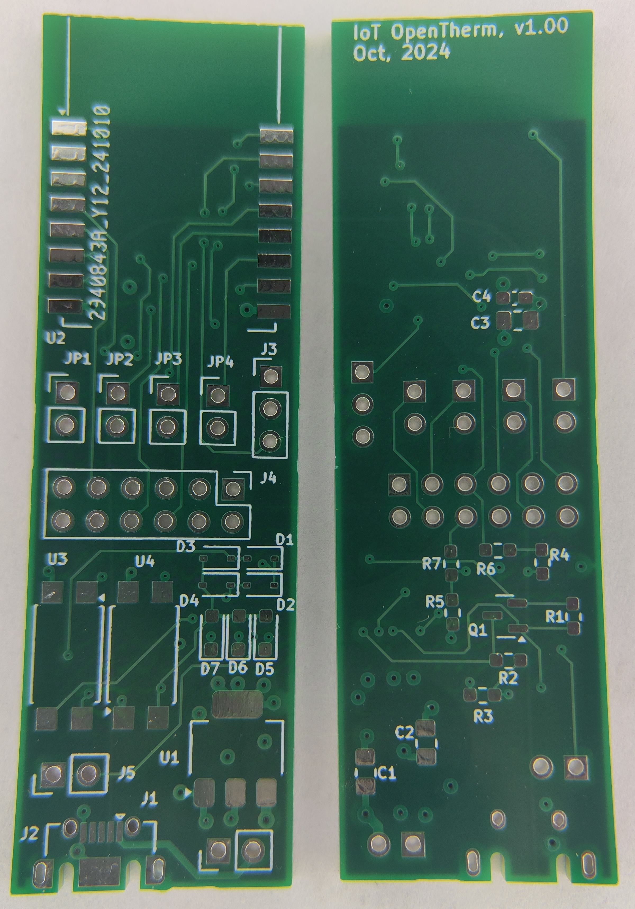
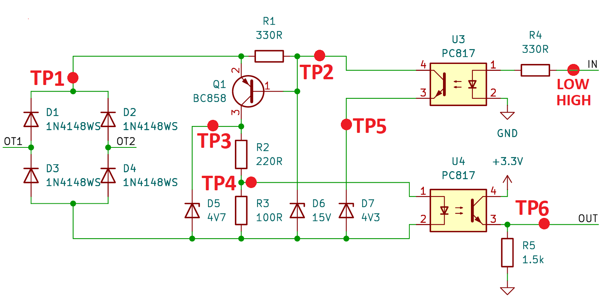

# IoT OpenTherm Project Hardware
IoT OpenTherm Hardware project is based on ESP-12S wifi module (used ESP8266 chip) and analog circuit derived from Ihor Melnyk [OpenTherm Adapter](https://ihormelnyk.com/opentherm_adapter) design.

## EDA
Project is prepared with KiCAD

### Version
Version: 8.0.5, release build

Libraries:
* wxWidgets 3.2.5
* FreeType 2.13.2
* HarfBuzz 9.0.0
* FontConfig 2.14.2
* libcurl/8.8.0-DEV Schannel zlib/1.3.1

Build Info:
* Date: Sep 7 2024 02:39:48
* wxWidgets: 3.2.5 (wchar_t,wx containers)
* Boost: 1.85.0
* OCC: 7.8.1
* Curl: 8.8.0-DEV
* ngspice: 42
* Compiler: Visual C++ 1939 without C++ ABI

## Components

* AiThinker ESP-12S WiFi module based on ESP8266 SoC. Documentation:
   * [ESP8266EX Datasheet](https://www.espressif.com/sites/default/files/documentation/0a-esp8266ex_datasheet_en.pdf)
   * [ESP8266 Technical Reference](https://www.espressif.com/sites/default/files/documentation/esp8266-technical_reference_en.pdf)
   * [ESP-12S Product Specification](../doc/ESP-12S%20-%20Product%20Specification.pdf)
   * [ESP-12S Specification](../doc/ESP-12S%20-%20Specification.pdf)
   * [ESP-12S Datasheet](../doc/ESP-12S%20-%20Datasheet.pdf)
   * [ESP-12S User Manual](../doc/ESP-12S%20-%20User%20Manual.pdf)
   * [ESP-12S Pinout](https://tasmota.github.io/docs/Pinouts/#esp-12s)
* Molex 475900001 USB AB micro connector: [details](https://www.molex.com/en-us/products/part-detail/475900001)
* 1117-3.3 (3.3V/1A) LDO, SOT-223: [details](https://www.st.com/resource/en/datasheet/ld1117.pdf)
* BC858 (A/B/C) PNP Transistor, SOT-23
* PC817 Photocoupler, SO-4
* Resistors 0603
* Capacitors 0603 and 0805
* Diodes (switching and Zeners) SOD-323
* Headers 2.54mm

### BOM
BOM can be found [here](bom.csv)

## PCB

### Vendor
[JLCPCB](https://jlcpcb.com)

### Stackup
* Material: FR4-Standard TG 135-140
* Layers count: 4 (L1.Signal, L2.GND, L3.VCC, L4.Signal)
* PCB Thickness: 1.6mm
* Prepreg: TBD
* PCB stackup: TBD 
* Via hole:
  * 12mils (0.3mm) for signals
  * 15mils (0.38mm) for power 1
  * 20mils (0.5mm) for power 2
* Via diameter:
  * 30mils (0.64mm) for signals
  * 35mils (0.89mm) for power 1
  * 45mils (1.00mm) for power 2
* Via annular ring:
  * 9mils (0.23mm) for signal
  * 10mils (0.25mm) for power 1
  * 15mils (0.38mm) for power 2
* Silkscreen: 30mils x 30mils x 6mils

More details about JLCPCB capabilities can be found [here](https://jlcpcb.com/capabilities/pcb-capabilities)

## Design
### Version 1.00
[SCH](doc/iot-opentherm_sch_v1p00.pdf)

[PCB](doc/iot-opentherm_pcb_v1p00.pdf)

[GERBERS](gerbers/gerbers_v1p00.zip)

BOARD:

## Tests
There are two types of test done. First, static test, with no OpenTherm endpoint device. Second, with OpenTherm endpoint device connected - boiler.

**Test was done for HW version 1.00**

### Static tests
Test was done by static voltage and current values verification at different parts of the circuit at different cases. It was done with no OpenTherm compatible endpoint connected.

Measurements were done for two different voltage values (4V, 15V) and four different current values (5mA, 9mA, 17mA, 23mA) at OT connector/pins. Those conditions (voltage and current) were inducted with power supply connected to OT connector/pins. For all test cases/points - power supply were configured to deliver 20V and different maximum current values ( 5mA, 9mA, 17mA, 23mA). Voltage at OT was clamped to ~15V when IN=LOW and to ~4V when IN=HIGH, which is expected. It proves that communication from controller (wifi module) to endpoint (boiler) works fine. Maximum current value were configured in power supplier for four different points: 5mA, 9mA, 17mA, 23mA. Those points were chosen as they are limit values specified in the [The OpenTherm Communications Protocol Specification](https://ihormelnyk.com/Content/Pages/opentherm_library/Opentherm%20Protocol%20v2-2.pdf).

Requirements:
* when IN=LOW, OT voltage >= 15V
* when IN=HIGH, OT voltage <= 7V
* when OT current is <=9mA, OUT < 0.8V
* when OT current is >=17mA, OUT > 2.0V

Below there are test results.

Test Points

Measurements at Test Points for different voltage and current values at OT connector/pins
| OT Voltage [V] | OT Current [mA] | TP1 [V] | TP2 [V] | TP3 [V] | TP4 [V] | TP5 [V] | TP6/OUT [V] |
| -------------- | --------------- | ------- | ------- | ------- | ------- | ------- | ----------- |
| 15 (IN=LOW)    | 5               | 15.75   | 15.12   | 0.95    | 0.27    | 0       | 0           |
| 15 (IN=LOW)    | 9               | 15.78   | 15.06   | 2.44    | 0.72    | 0       | 0           |
| 15 (IN=LOW)    | 17              | 15.81   | 15.12   | 4.37    | 1.13    | 0       | 3.11        |
| 15 (IN=LOW)    | 23              | 15.83   | 15.11   | 4.64    | 1.14    | 0       | 3.12        |
| 4 (IN=HIGH)    | 5               | 4.76    | 4.12    | 0.91    | 0.26    | 4.12    | 0           |
| 4 (IN=HIGH)    | 9               | 4.81    | 4.14    | 2.44    | 0.70    | 4.01    | 0           |
| 4 (IN=HIGH)    | 17              | 4.86    | 4.16    | 4.33    | 1.13    | 4.03    | 3.10        |
| 4 (IN=HIGH)    | 23              | 4.89    | 4.18    | 4.63    | 1.14    | 4.03    | 3.11        |

Conclusions:
* all the requirements were satisfied
* the only concern is about the voltage at IN which was 3.1V in HIGH. Expected more. This does not impact functionality of the circuit. But it will be investigated anyway.

### Tests with OpenTherm compatible endpoint, e.g. boiler.
TBD
