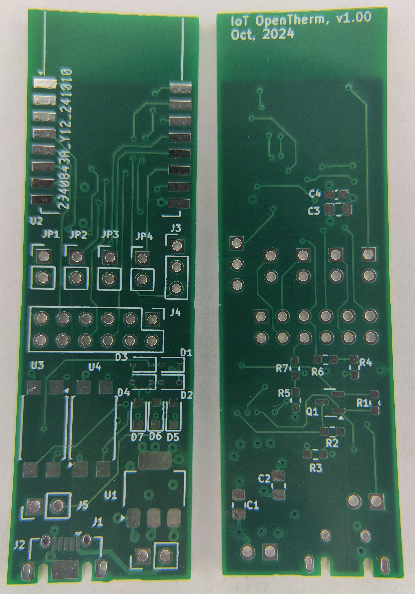
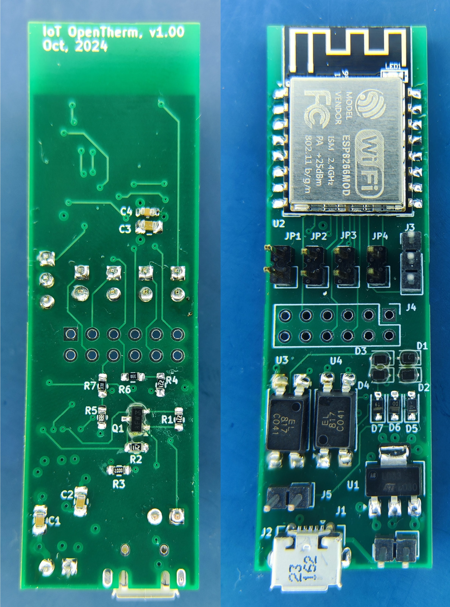

# IoT OpenTherm Project Hardware
IoT OpenTherm Hardware project is based on ESP-12S wifi module (used ESP8266 chip) and analog circuit derived from Ihor Melnyk [OpenTherm Adapter](https://ihormelnyk.com/opentherm_adapter) design.

## EDA
Project is prepared with KiCAD

### Version
Version: 8.0.5, release build

Libraries:
* wxWidgets 3.2.5
* FreeType 2.13.2
* HarfBuzz 9.0.0
* FontConfig 2.14.2
* libcurl/8.8.0-DEV Schannel zlib/1.3.1

Build Info:
* Date: Sep 7 2024 02:39:48
* wxWidgets: 3.2.5 (wchar_t,wx containers)
* Boost: 1.85.0
* OCC: 7.8.1
* Curl: 8.8.0-DEV
* ngspice: 42
* Compiler: Visual C++ 1939 without C++ ABI

## Components

* AiThinker ESP-12S WiFi module based on ESP8266 SoC. Documentation:
   * [ESP8266EX Datasheet](https://www.espressif.com/sites/default/files/documentation/0a-esp8266ex_datasheet_en.pdf)
   * [ESP8266 Technical Reference](https://www.espressif.com/sites/default/files/documentation/esp8266-technical_reference_en.pdf)
   * [ESP-12S Product Specification](../doc/ESP-12S%20-%20Product%20Specification.pdf)
   * [ESP-12S Specification](../doc/ESP-12S%20-%20Specification.pdf)
   * [ESP-12S Datasheet](../doc/ESP-12S%20-%20Datasheet.pdf)
   * [ESP-12S User Manual](../doc/ESP-12S%20-%20User%20Manual.pdf)
   * [ESP-12S Pinout](https://tasmota.github.io/docs/Pinouts/#esp-12s)
* Molex 475900001 USB AB micro connector: [details](https://www.molex.com/en-us/products/part-detail/475900001)
* 1117-3.3 (3.3V/1A) LDO, SOT-223: [details](https://www.st.com/resource/en/datasheet/ld1117.pdf)
* BC858 (A/B/C) PNP Transistor, SOT-23
* PC817 Photocoupler, SO-4
* Resistors 0603
* Capacitors 0603 and 0805
* Diodes (switching and Zeners) SOD-323
* Headers 2.54mm

### BOM
BOM can be found [here](bom.csv)

## PCB

### Vendor
[JLCPCB](https://jlcpcb.com)

### Stackup
* Material: FR4-Standard TG 135-140
* Layers count: 4 (L1.Signal, L2.GND, L3.VCC, L4.Signal)
* PCB Thickness: 1.6mm
* Prepreg: TBD
* PCB stackup: TBD 
* Via hole:
  * 12mils (0.3mm) for signals
  * 15mils (0.38mm) for power 1
  * 20mils (0.5mm) for power 2
* Via diameter:
  * 30mils (0.64mm) for signals
  * 35mils (0.89mm) for power 1
  * 45mils (1.00mm) for power 2
* Via annular ring:
  * 9mils (0.23mm) for signal
  * 10mils (0.25mm) for power 1
  * 15mils (0.38mm) for power 2
* Silkscreen: 30mils x 30mils x 6mils

More details about JLCPCB capabilities can be found [here](https://jlcpcb.com/capabilities/pcb-capabilities)

## Design
### Version 1.00
[SCH](doc/iot-opentherm_sch_v1p00.pdf)

[PCB](doc/iot-opentherm_pcb_v1p00.pdf)

[GERBERS](gerbers/gerbers_v1p00.zip)

BOARD:

